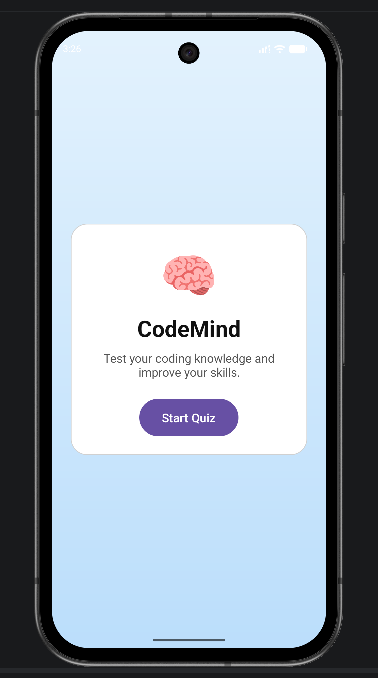
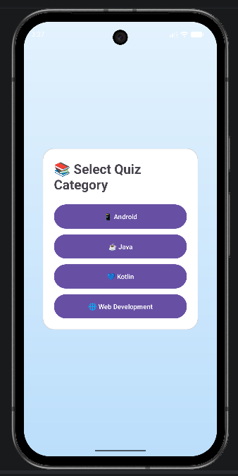
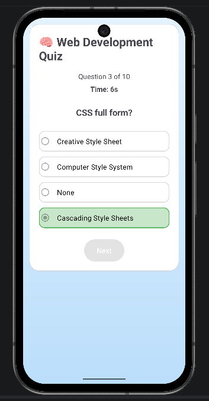
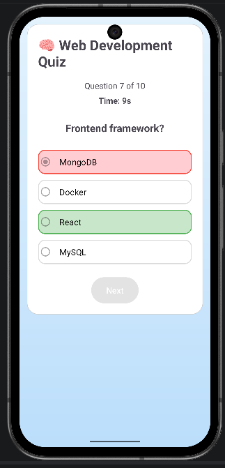
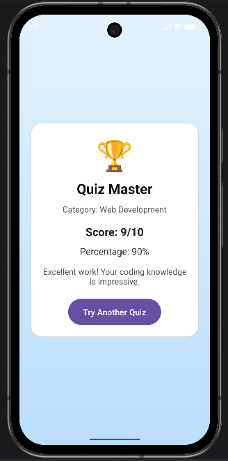

# CodeMind Quiz App

CodeMind is an Android quiz application built using Kotlin and Jetpack Compose. The app helps users test and improve their programming knowledge through interactive quizzes.

## Screenshots

## Screenshots

<table>
<tr>
<td align="center">
<b>Welcome Screen</b>  

</td>

<td align="center">
<b>Category Selection</b>  

</td>

<td align="center">
<b>Correct Answer</b>  

</td>
</tr>

<tr>
<td align="center">
<b>Wrong Answer</b>  

</td>

<td align="center">
<b>Result Screen</b>  

</td>
</tr>
</table>

## Features

* Multiple quiz categories

* Android
* Java
* Kotlin
* Web Development
* Timed quiz sessions
* Randomized questions and options
* Instant answer feedback
* Score and percentage calculation
* Result summary screen
* Clean and user-friendly interface

## Tech Stack

* Kotlin
* Jetpack Compose
* Android Studio

## Screens

* Welcome Screen
* Category Selection
* Quiz Screen
* Result Screen

## Project Goal

The goal of this project is to provide an engaging platform for learning and assessing programming knowledge through quizzes.
